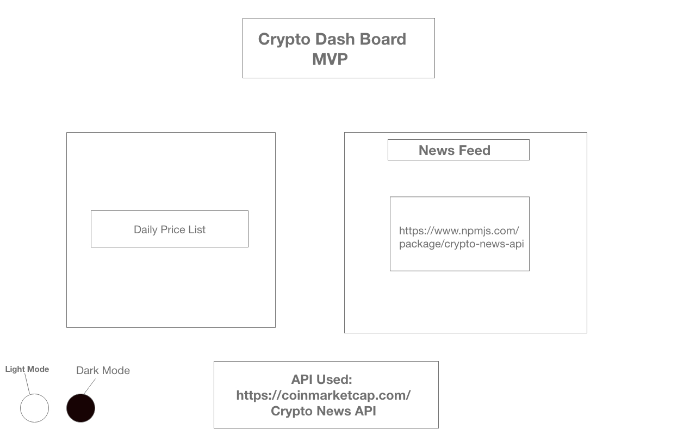
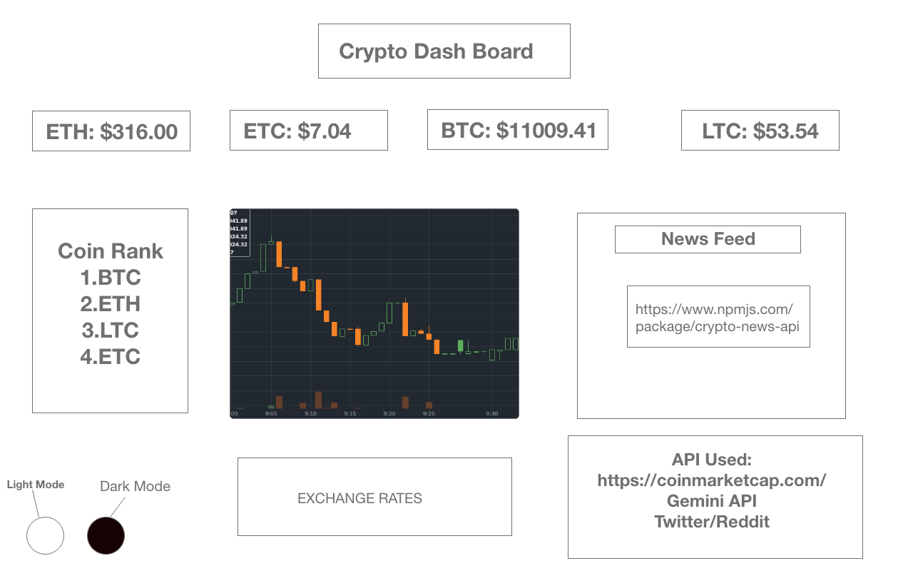

# Crypto Currency Dashboard
- Are you sick and tired of having multiple tabs open?
- Is your computer slow while you buy & sell your crypto currency?

- Do you need to see realtime news & data to make an informed purchase?
- Would you like to see all your coins being traded in realtime?
- Want to stay informed with the latest crypto currency news?

## :alarm_clock: Your Wait Is Over! :alarm_clock:

# CryptoDash 
- Is a cryptocurrency dashboard that pulls data & news in realtime. 
- It allows you to filter by coin and see market trends
- 

# MVP
- Shows Price :dollar:
- News about Crypto :newspaper: 

## SUPER MVP
- Ranking :chart_with_upwards_trend:
- Ticker :bar_chart:
- Time/Value data 	:chart:

# Tech Stack
- React
- Redux 
- Firebase
- APIs
- Material UI
- JS
- HTML 
- CSS

# Currently in Beta: Expected roadblocks :construction:
- Integrating everything smoothly :surfer:
- Redux :zombie:
- May run out of coffee :coffee:
- Needs to style this to look :fire:
- Manage my time effectively :mage_woman:

# Timeframe: This is a 1 :woman_technologist: operation 
+ Need to build the interface 
+ 
+ Pull API data from Gemini/ Crypto Control :inbox_tray:
+ Style all the components :haircut_woman:

# When all the above is executed...

